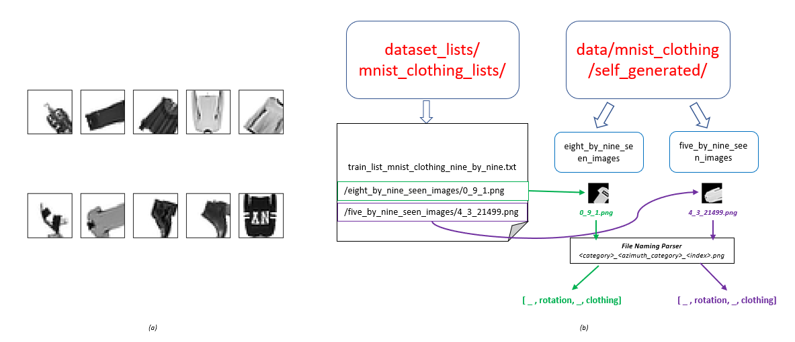
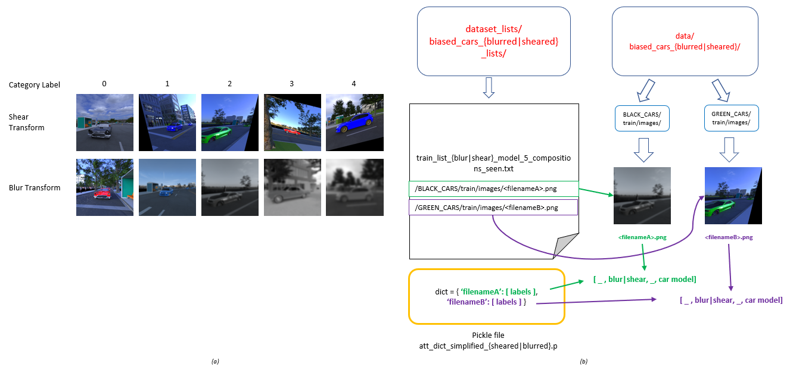

img {
  pointer-events: none;
  user-select: none;
}  

# Investigating Techniques to Improve CNN Generalization on OOD Samples  

This repository is heavily inspired by the original work from the following repo:  
https://github.com/Spandan-Madan/generalization_to_OOD_category_viewpoint_combinations  
  
The original work is done by Madan et. al. We'll be using the original code provided by them as the baseline on which we'll make some modifications to investigate how we can improve on CNN generalization on OOD Samples.  
  
There are 3 datasets that we use in this code:  
1\. MNIST Clothing Rotation (To experiment on a deformable object dataset as well as discrete rotations and noisy rotations).  
  
2\. Blurred Biased Car (To increase the transformations on the cars images).  
  
3\. Sheared Biased Car (To increase the transformations on the cars images).  
  

Initial playground code:  
This is located in demos/Deep_Learning_Project_Code_Playground.ipynb  
(This code is our initial attempt at emulating and rotating the MNIST Handwriting dataset with rotations and noise by training a simpler network than what we have in the original paper). The goal is to illustrate the difficulty when it comes to viewpoint and category learning.  

MNIST clothing rotation and discrete data transformation:
This code generates rotated MNIST clothing images from the MNIST clothing dataset. The MNIST clothing dataset has 10 classes (similar to MNIST handwriting). Run data/mnist_clothing/gen_mnist_clothing_discrete_rotation_data.py to auto generate the clothing dataset with discrete rotation. The way the code work is it rotates the clothing dataset in discrete angles between 0 to 360 (in steps of 36) in order to form 10 unique rotation viewpoint classes. After running it, you can try running demos/increasing_in_distribution_combinations_modified_with_mnist_clothing.ipynb to see how the network behaves when running on the rotated clothing dataset. Alternately running the demo code directly in colab (using the colab button) automatically runs both steps for you.     
  
MNIST clothing rotation and noisy data transformation:
Another code generates rotated MNIST Clothing images but this time with noise. The way the noise is generated is that it adds some fraction of rotation angle on top of the discrete angles from before. There's a code to generate the noisy version in /data/mnist_noisy_rotation_clothing/gen_mnist_clothing_noisy_rotation_data.py to autogenerate the noisy rotation version. After running it, you can try running demos/increasing_in_distribution_combinations_modified_with_mnist_noisyrotclothing.ipynb to see the results of running on a noisy rotation dataset. Alternately running the demo code directly in colab (using the colab button) automatically runs both steps for you.    
  
Diagramatic explanation for the MNIST Clothing data architecture:  
  

Biased car with blurring transformation:
This code transforms the original biased car dataset with additional blurring effect. Please run the bash script in utils/download_biased_cars.sh first to download the original biased cars dataset and have it decompressed and setup. And then run data/biased_cars_blurred/generate_biased_cars_blurred.py which transforms the original data and generates the blurred bias cars dataset. After that, you can try running demos/using_biased_cars_modified_with_blur.ipynb to train and evaluate the biased cars results. There's no colab button for this code unlike the MNIST clothing version so everything has to be run separately.  
  
Biased car with shearing transformation:
This code transforms the original biased car dataset with additional shearing effect. Please run the bash script in utils/download_biased_cars.sh first to download the original biased cars dataset and have it decompressed and setup. And then run data/biased_cars_sheared/generate_biased_cars_sheared.py which transforms the original data and generates the sheared bias cars dataset. After that, you can try running demos/using_biased_cars_modified_with_shear.ipynb to train and evaluate the biased cars results. There's no colab button for this code unlike the MNIST clothing version so everything has to be run separately. 
  
Diagramatic explanation for the Blurred/Sheared biased cars data architecture:  
  
  
Contributers:  
Zixiang Loh zl3021@columbia.edu  
Alexandre Raeval atr2122@columbia.edu  
John Blackwelder jwb2168@columbia.edu  
